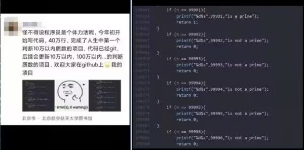
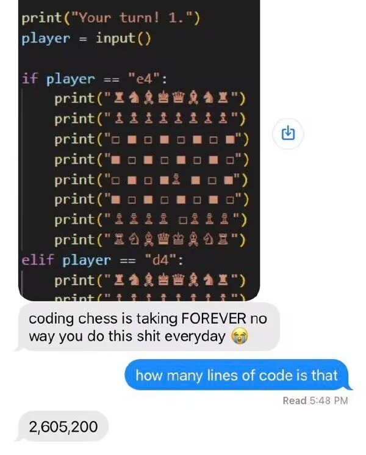

# is_prime_O1
生成一个判断一个数是否为质数的算法时间复杂度为O(1)的程序的程序（整活儿）

下载仓库：`clone git@github.com:Staok/is_prime_O1.git`。

win 平台上编译：

1. 编译主程序 `gcc main.c -o main.exe`，并运行 `main.exe`，运行完会生成一个 `is_prime.c` 文件。

2. 再编译 `is_prime.c` 文件 `gcc is_prime.c -o is_prime.exe`，会得到 `is_prime.exe`。

   运行 `is_prime.exe`，即可输入一个数字，程序会在 O(1) 时间复杂度下返回这个数是否质数~

在 `main.c` 文件中 修改 `HOW_MANY_DO_YOU_WANT` 宏 即可修改生成文件 `is_prime.c` 中判断质数的范围：

```c
/* 请问您生成一个判断多少以内的质数的时间复杂度为O(1)的程序呢亲~
    只要您的磁盘容得下呢~经验值，填入10w生成的文件约为10MB */
#define HOW_MANY_DO_YOU_WANT 1000
```

------

起初，是无意间看到一个图：



刚看了图的时候，以为是整个什么活笑死，后来猛然意识到这玩意儿写的这么规律...

用程序生成这个程序好了~（说不定上图也是这么整出来的）

------

又看见一个类似的图


